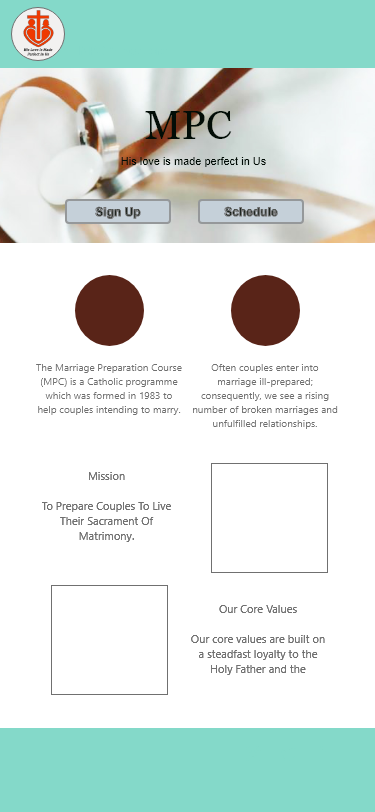
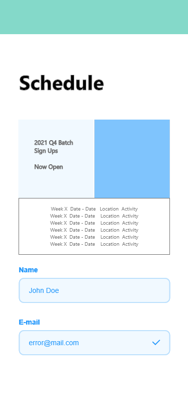
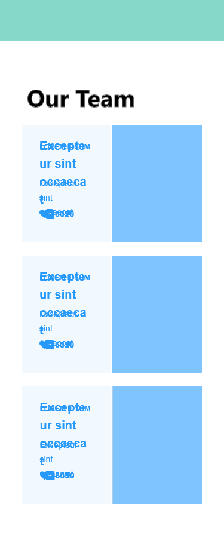
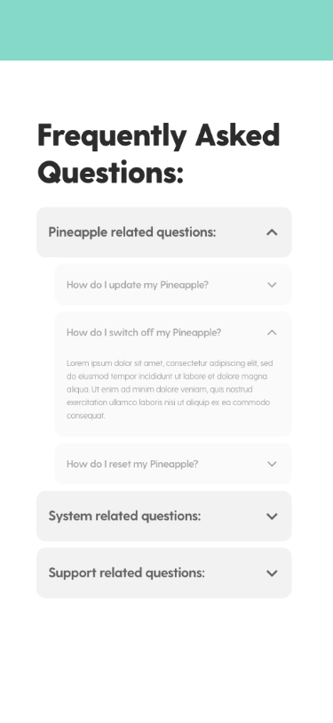
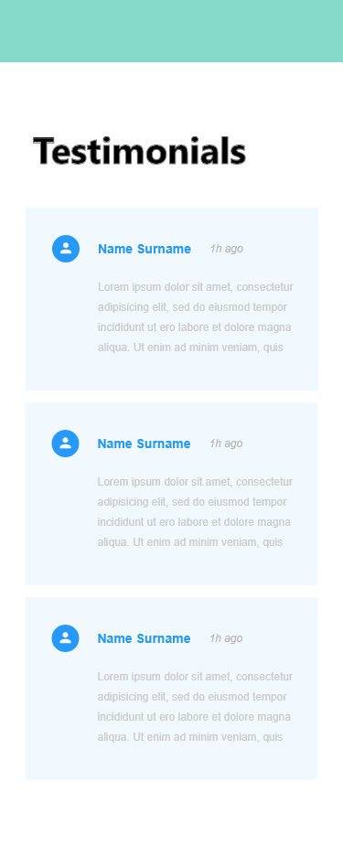

#  Catholic MPC Singapore Website 

# 1. Background & Objective
- Complete Milestone Project 1: User-Centric Front-end Development
- Create something useful for "Marriage Preparation Course Singapore" so that there is real-world applications to what I have learned
- Create a website that has the principles of user-experience design, accessibility and responsiveness
- Existing non-responsive **[MPC Singapore Website](https://www.mpcsingapore.com/)**


# 2. Demo
Deployed result of efforts via Github Pages
**[Re-worked MPC Singapore Website](https://malrhis.github.io/Project-1-codeinstitute/index.html)**

# 3. Technologies Used
- HTML 5
- CSS
- Bootstrap 4
- Github - for Version Control

# 4. The Goals: User Stories or (JTBD) Jobs-to-be-Done
```
1. As a user I would like to find out about what MPC is about easily when I land on the homepage
2. As a user I would like to know what's the schedule of MPC
3. As a user I would like to be able to sign up for MPC if I feel that it suits me
4. As a user I would like to know more about the people running the course
5. As a user I would like to know how other people felt about the course after they attended it
6. I would like to be able to access this information on the go
```

# 5. Key Features
The user stories show that most users require an information repository laid out to them in an easily digestible manner, something which modern web design can handle via technologies like **Bootstrap 4**. 

The key difference between the old website and the one I am putting together is the mobile responsiveness of the website, as well as the 

1. Navigation Bar Spanning all pages
2. Mobile Responsiveness
3. Impactful homepage with CTA to redirect users to other parts of the site
4. Other pages to accomodate information listed in User Story / JTBD section

# 6. Prototyping

## 6.1 Prototyping was done using Adobe XD
- Wire-frame kit recommended by [Adobe XD Ideas](https://xd.adobe.com/ideas/process/wireframing/wireframe-templates-for-ux-designers/) was used
- I chose the [Wires Template](https://www.behance.net/gallery/55462459/Wires-wireframe-kits-for-Adobe-XD) as a base to do my UI prototyping. 
- Credits to the creators of Wires: [Kyle Galle](https://www.behance.net/kgalle_adobe), [UI8](https://www.behance.net/ui8), and [Jonathan Pimento](https://www.behance.net/jonathanpimento)
<br>

## 6.2 Existing Website Content
MPC Singpore's existing website had an outdated UI, but was clearly separated into a few sections
1. Homepage
2. Course Application
3. FAQ
4. Testimonies
5. About Us
6. Miscellaneous information such as Contacts, related websites

For the purpose of this project, I grouped items into a few key pages.
The below table lists these pages and their mockups.
<br>

## 6.3 Front-End UI Mock-up (AdobeXD)

| Homepage | Apply | Our Team| FAQ|Testimonials|
|---|---|---|---|---|
|| | ||
<br>

### 6.3.1 Components
Since bootstrap is mobile first, all mockups were done with a mobile template in mine. Referencing the User Stories and the information that MPC Singapore already has Existing Website Content we can determine the key features features that would both fulfill the User Stories and the Existing Website Content.

- Navigation Bar
- Footer
- Carousel
- Application Section with Sign-up form
- Calendar Section 
- Team Section
- Testimonial Section

### 6.3.2 Colour
The colour scheme used to be chosen based on original website, but in order to modernise the look to be more classy, a black and white theme was chosen for the final layout instead.

# 7. Bootstrap 4 Implementation
Bootstrap 4 was used for re-building the website in a responsive, mobile-first manner 
You can access Boostrap 4 resouces [here](https://getbootstrap.com/docs/4.5/getting-started/introduction/)

The below `code snippets` were added to HTML `<head>`

- For CSS
```
    <link rel="stylesheet" href="https://cdn.jsdelivr.net/npm/bootstrap@4.5.3/dist/css/bootstrap.min.css" integrity="sha384-TX8t27EcRE3e/ihU7zmQxVncDAy5uIKz4rEkgIXeMed4M0jlfIDPvg6uqKI2xXr2" crossorigin="anonymous">
```
- For JS
```
<script src="https://code.jquery.com/jquery-3.5.1.slim.min.js" integrity="sha384-DfXdz2htPH0lsSSs5nCTpuj/zy4C+OGpamoFVy38MVBnE+IbbVYUew+OrCXaRkfj" crossorigin="anonymous"></script>
<script src="https://cdn.jsdelivr.net/npm/popper.js@1.16.1/dist/umd/popper.min.js" integrity="sha384-9/reFTGAW83EW2RDu2S0VKaIzap3H66lZH81PoYlFhbGU+6BZp6G7niu735Sk7lN" crossorigin="anonymous"></script>
<script src="https://cdn.jsdelivr.net/npm/bootstrap@4.5.3/dist/js/bootstrap.min.js" integrity="sha384-w1Q4orYjBQndcko6MimVbzY0tgp4pWB4lZ7lr30WKz0vr/aWKhXdBNmNb5D92v7s" crossorigin="anonymous"></script>
```

# 8. Boostrap 4 Templates & Examples Used
The following Boostrap resouces were used in creating this website. Credits to the bootstrap team for these free resources and the tutorials the `getbootstrap.com`

|Resource|URL|Description|
|---|---|---|
|General Grid and Layout|[Link](https://getbootstrap.com/docs/4.5/layout/overview/)|Bootstrap grid system for layout|
|Tweaking sizing & positioning|[Link](https://getbootstrap.com/docs/4.5/utilities/)|Full list of bootstrap utility classes to manage changes in size and positioning
|Carousel|[Link](https://getbootstrap.com/docs/4.5/examples/carousel/)|Used for navbar and Homepage carousel & featurette|
|Sticky footer|[Link](https://getbootstrap.com/docs/4.5/examples/sticky-footer/)|Used for page footer|
|Jumbotron|[Link](https://getbootstrap.com/docs/4.5/components/jumbotron/)|Used for Hero Images|
|Collapse Accordion|[Link](https://getbootstrap.com/docs/4.5/components/collapse/#accordion-example)|Used for FAQ section|
|Forms|[Link](https://getbootstrap.com/docs/4.5/components/forms/)|For creating pseudo form|
<br>

**Please Note** due to nature of project (Only front-end focused), the sign-up form does not actually collect data and store it in a back-end database.
<br>

# 9. Content Credits - Text
- **All text** content in the pages are the property of **[MPC Singapore Website](https://www.mpcsingapore.com/)**
- I do not claim any of MPC Singapore's content as my own. All rights belong to MPC Singapore's managing committee.

## 9.1 Fonts used
The font used in all pages are customized to Roboto.
Inspiration to use Roboto was from [fontpair.co's featured pairs](https://fontpair.co/#featured-pairs)

Initially `Domine & Roboto` were choses as the Heading and Body pairs, but Domine did not suit the sleek look and feel of the website. 

I opted to simply go for `Roboto & Roboto` instead, with a heavier font weight for the `navbar`. Some customizations were used for `navbar-text`

Fonts were implemented using [Google fonts](https://fonts.google.com/specimen/Roboto), and styled/customized in external css file `style.css` 

```
font-family: 'Roboto', sans-serif;
```

# 10. Content Credits - Pictures
The below list lists out the key sources of all the pictures used in the [demo](https://github.com/Malrhis/Project-1-codeinstitute#demo). 

I do not claim any of the pictures or logos used as my own.
All rights belong to the owners of these websites, and the photographers that produced theses photos.

1. [Photos taken from MPC Singapore's website](https://www.mpcsingapore.com/)
2. [Khamkéo Vilaysing's photo](https://unsplash.com/photos/OcxlTBbb6SY)
3. [Helena Lopes's photo](https://unsplash.com/photos/PGnqT0rXWLs)
3. [Photo taken from HerWorld magazine's article on 23 Gorgeous Ways These Couples Styled Their Church Weddings](https://www.herworld.com/gallery/fashion/shopping/wedding-decor-couples-styled-church-singapore/)
4. [Photo taken Mike Chen Photography](http://weddingphotographysingapore.com/actual-day-wedding/church-of-transfiguration-mbs-wedding-singapore/)
4. My own church wedding photos taken by [Lightedpixels photography](https://www.lightedpixels.com/)
5. Group pictures taken from `my own MPC group`'s Whatsapp media history
6. To achieve a professional "Team" page; pictures of acquaintances were taken from linkedin profiles, generated by linkedin CDN (content delivery network) `https://media-exp1.licdn.com/dms/image/`

# 11. Testing
## 11.1 Code Validation using Code Validators
- All HTML files were passed through [W3C's Nu Html Checker](https://validator.w3.org/nu/#file)
- All CSS files were passed through [W3C's Jigsaw CSS Validation Service](https://jigsaw.w3.org/css-validator/#validate_by_upload)

HTML and CSS files were uploaded to both validators and code was edited to ensure that no errors remained

## 11.2 User Acceptance Testing + Bug fixing Process
The following process was followed to ensure that the site works on Github pages, on a desktop browser and on Mobile:
1. Commit and Push Changes to Main Brance
2. Go to [site](https://github.com/Malrhis/Project-1-codeinstitute#demo) to perform Live verification
3. Inspect elements in page
4. Check for general formatting
5. Check for any broken images
6. Refer to console and refresh to check for broken GET API requests or broken Links
7. Attempt to fix the code in console to see the effects of code edits
8. Once bug is found, apply fix to code
9. Perform another commit and push changes
10. Check if bug is fixed by going to [site](https://github.com/Malrhis/Project-1-codeinstitute#demo)
11. Repeat.

# 12. Bugs Found
|#|Bug Description|Fix|
|---|---|---|
|1|Images did not render after deploying to Github Pages| Problem with Relative link path. `/images/imagename.jpg` was used instead of `images/imagename.jpg` and for the css subfolder,  `../images/imagename.jpg` should be used in order to handle the subfolder pathing.|
|2|Found no gap between `navbar-brand` icon and and text in `faq.html` and `testimonials.html`.| Fixed adjustment to align with other `html` files.  

# 13. Deployment
Website is currently deployed on using Github Pages.

**Homepage link: 
https://malrhis.github.io/Project-1-codeinstitute/index.html**

# 14. Acknowledgements
- [Mr Malcolm Yam](https://www.linkedin.com/in/malcolmyam/) - Who introduced us to bootstrap
- [Mr Arif Rawi](https://www.linkedin.com/in/arif-rawi-9661aa192/) - Who taught us HTML and CSS basics